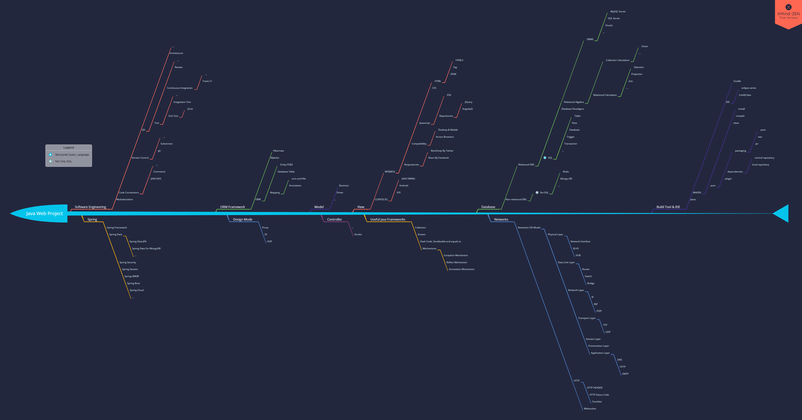

# Java Web Project  
Written By Arvin(Arvinsichuan@mail.arvinsichuan.com)  
Review By ash-morgan(ashmorgan@mail.arvinsichuan.com)  
LISCENCE: [CC BY-NC-SA 4.0](https://creativecommons.org/licenses/by-nc-sa/4.0/)

# Overview / 总览  


(click the diagram to see the full image)

# Build Tool & IDE $^※$
## Javac
## MAVEN  
### project/package name conventions
`org.orgnization.project.module`:`artifact-id`,  
`com.company.project.module`:`artifact-id`
### Version

### pom
### package Type
- jar
- war  
- pom
### Commonly used command
- `clean`
- `compile`
- `install`
- `-Dmaven.test.skip=true` to skip test cases.
## Gradle  
## eclipse  
## IntelliJ Idea
JetBrains provide free professional version of all products, just use an `.edu` suffix email. You can get it [here](https://www.jetbrains.com/idea/).


# Networks
## OSI $^※$  
- Application Layer  
- Presentation Layer
- Session Layer  
- Transport Layer  
- Network Layer  
- Data Link Layer  
- Physical Layer  


## HTTP  
HTTP: Hyper-Text Transport Protocol.
### HTTP HEADER
HEADER EXAMPLE:  
- Request HEADER:  
```http
GET / HTTP/1.1
Host: localhost:8081
Connection: keep-alive
Pragma: no-cache
Cache-Control: no-cache
Upgrade-Insecure-Requests: 1
User-Agent: Mozilla/5.0 (Windows NT 10.0; Win64; x64) AppleWebKit/537.36 (KHTML, like Gecko) Chrome/64.0.3282.140 Safari/537.36
Accept: text/html,application/xhtml+xml,application/xml;q=0.9,image/webp,image/apng,*/*;q=0.8
DNT: 1
Accept-Encoding: gzip, deflate, br
Accept-Language: zh-CN,zh;q=0.9,en;q=0.8
Cookie: optimizelyEndUserId=oeu1508770071069r0.8216389827524377; Idea-e6ee67b6=5472c172-c9cc-40f3-9fed-5edde36943de; _ga=GA1.1.2125353372.1508770072; Hm_lvt_82116c626a8d504a5c0675073362ef6f=1514964566; JSESSIONID=AC7E9FAC2A19238F5764F7C7998ED73C
```
- Response HEADER:  
```http
HTTP/1.1 200
X-Content-Type-Options: nosniff
X-XSS-Protection: 1; mode=block
Cache-Control: no-cache, no-store, max-age=0, must-revalidate
Pragma: no-cache
Expires: 0
X-Frame-Options: DENY
X-Application-Context: application:8081
Content-Type: text/html;charset=UTF-8
Content-Language: zh-CN
Transfer-Encoding: chunked
Date: Sat, 03 Feb 2018 06:21:27 GMT
Accept:text/html,application/xhtml+xml,application/xml;q=0.9,image/webp,image/apng,*/*;q=0.8
Accept-Encoding:gzip, deflate, br
Accept-Language:zh-CN,zh;q=0.9,en;q=0.8
Cache-Control:no-cache
Connection:keep-alive
Cookie:optimizelyEndUserId=oeu1508770071069r0.8216389827524377; Idea-e6ee67b6=5472c172-c9cc-40f3-9fed-5edde36943de; _ga=GA1.1.2125353372.1508770072; Hm_lvt_82116c626a8d504a5c0675073362ef6f=1514964566; JSESSIONID=AC7E9FAC2A19238F5764F7C7998ED73C
DNT:1
Host:localhost:8081
Pragma:no-cache
Upgrade-Insecure-Requests:1
User-Agent:Mozilla/5.0 (Windows NT 10.0; Win64; x64) AppleWebKit/537.36 (KHTML, like Gecko) Chrome/64.0.3282.140 Safari/537.36
```
### HTTP Status code  
- 100: Continue
- 101: Switching Protocols
- 200: OK
- 301: Moved Permanently
- 400: Bad Request
- 403: Forbidden
- 404: Not Found
- 405: Method Not Allowed
- 500: Internal Server Error
## Websocket  
A computer communications protocol, providing full-duplex communication channels over a single TCP connection.

# Database   
## SQL $^※$    
```SQL
SELECT * FROM MY_TABLE WHERE CONDITION = "My-Condition";
```
## Relational DBS
- MySQL Server  
[Official Website](https://www.mysql.com/)
- SQL Server    
There is a free education version for teachers and students provided and supported by [Microsoft Imagine](https://imagine.microsoft.com/zh-cn)  
- Oracle  
[Free Download Site](http://www.oracle.com/technetwork/database/enterprise-edition/downloads/index.html)

## Non-Relation DBS
- Redis  
Commonly used for high speed cached.
- MongoDB  
Usually for non structural data persistence.


# Useful Java Frameworks  
## Collection
- List
- Map
- Set
## Stream  
- filter()
- sort()
- map()
- reduce()
- limit()
- skip()

## Hash Code, `equal to` and Serializable
## Mechanisms
### Exception  
Rollback, customized Exception
### Reflect
To find all object of members in runtime.
### Annotation
Simplified the code and the comprehension.

# Design Mode
## IOC(DI) $^※$
## AOP $^※$
## Proxy


# MVC Overview  
## What is MVC?
A famous and wide used architecture.  
- Model
Mainly responsible for business codes.  
- View  
The UI, the closest part to an end user.
- Controller  
The operation dispatcher, just like green-red light.


## Why MVC?  
To simplify development.
## How to implement a MVC Architecture?  
Using packages.  
## Servlet Implementation  
Servlet Controller:  
response the request from client by `do###()` method.
```Java
// 扩展 HttpServlet 类
public class HelloWorld extends HttpServlet {

  private String message;

  public void init() throws ServletException
  {
      // 执行必需的初始化
      message = "Hello World";
  }

  public void doGet(HttpServletRequest request,
                    HttpServletResponse response)
            throws ServletException, IOException
  {
      // 设置响应内容类型
      response.setContentType("text/html");

      // 实际的逻辑是在这里
      PrintWriter out = response.getWriter();
      out.println("<h1>" + message + "</h1>");
  }

  public void destroy()
  {
      // servlet 销毁时所需要的额外业务
  }
}
```

# Spring Overview  
## What is spring?
[Spring Framework wiki](https://en.wikipedia.org/wiki/Spring_Framework)  
[Official Site](https://spring.io)  
Spring is a series of open source projects.
- Spring Framework
- Spring Security
- Spring Data
- Spring AMQP
- Spring Session
- Spring Boot
## How does it work?
AOP, DI etc....  
Spring is full of Design Mode.
## How to learn to use it?
1. go to the Official Website,
2. following the guides,
3. be patient.

# Continue to learn
- [HTTP](https://en.wikipedia.org/wiki/Hypertext_Transfer_Protocol)  
- [SQL](http://www.w3school.com.cn/sql/index.asp)

- [JAVA Reflect Mechanism](http://blog.csdn.net/sinat_38259539/article/details/71799078)
- [学习java应该如何理解反射？](https://www.zhihu.com/question/24304289)

- [Java8 Stream ref1](https://www.liaoxuefeng.com/article/001411309538536a1455df20d284b81a7bfa2f91db0f223000)
- [Java8 Stream ref2](https://mp.weixin.qq.com/s?__biz=MjM5NzM0MjcyMQ==&mid=2650078259&idx=2&sn=6110914eb11d8f513d69f241e233e729&chksm=bedb275d89acae4b1424f777508666106c7d5bc3c8ca503eb15ec4a7a0a42d18e0b3f5c5eba9&mpshare=1&scene=1&srcid=0130WYobY7mP2Nc20eHGaxcU#rd)
- [Servlet 教程](http://www.runoob.com/servlet/servlet-tutorial.html)
# Notes:
1. IDE: Integrated Development Environment
2. OSI: Open System Interconnection
3. SQL: Structured Query Language
4. DI: Dependency Injection
5. IOC: Inverse of Control
6. AOP: Aspect Oriented Programming


-----  

<a rel="license" style="text-decoration:none" href="http://creativecommons.org/licenses/by-nc-sa/4.0/">
    <div style="margin-top:0.5em;margin-bottom:1em;">
        
        
        
        
        
     </div>
</a>
<br />
This work is licensed under a <a rel="license" href="http://creativecommons.org/licenses/by-nc-sa/4.0/">Creative Commons Attribution-NonCommercial-ShareAlike 4.0 International License</a>.

CREATED BY [ArvinSiChuan](mailto:arvinsc@foxmail.com?subject=LearningMaterialsOfDawnTeam), 03-Feb-2018.  
Updated at 03-Feb-2018, VERSION 0.1.
